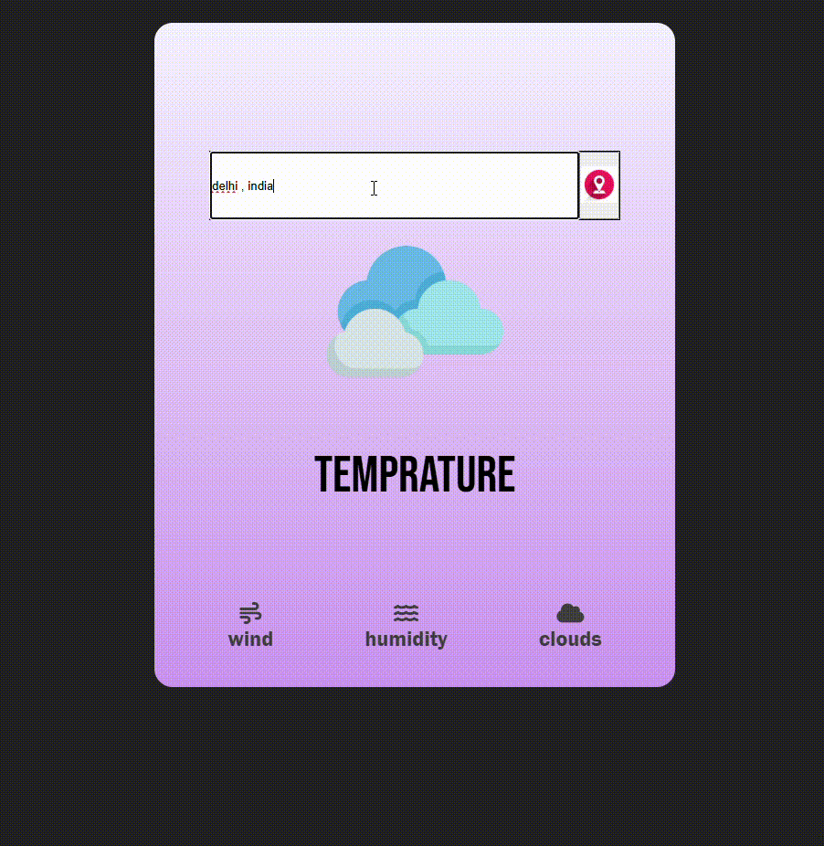

WEATHER APPLICATION  
-tracks real time temprature , humidity , cloudiness and wind speed of a city / country.
__________________________________________
A sleek , dynamic weather application that provides real-time weather updates.  
Key Features :  
Real-Time Weather Updates 
Detailed Analytics 
API Integration 
User-Friendly Design: 
__________________________________________
DEMO :  

__________________________________________
Usage:

1. Hover over the search box.  
2. Enter the desired location in the format: City, Country. 
3. Click on the search button. 
4. The APIs will fetch the data based on your query. 
5. The results will be displayed within seconds. 
__________________________________________
Technologies Used :  
1. HTML, CSS, JavaScript/Vanilla Javscript. 
2. Open-Meteo API. 
3. OpenCage Geocoding API. 
__________________________________________

 API References :  
 1. OpenCage API :  https://api.opencagedata.com/geocode/v1/json?q=Paris%2C+France&key={YOUR_API_KEY}
 2. OpenWeather API : https://api.open-meteo.com/v1/forecast?latitude=52.52&longitude=13.41&hourly=temperature_2m,cloud_cover,wind_speed_10m,snowfall
